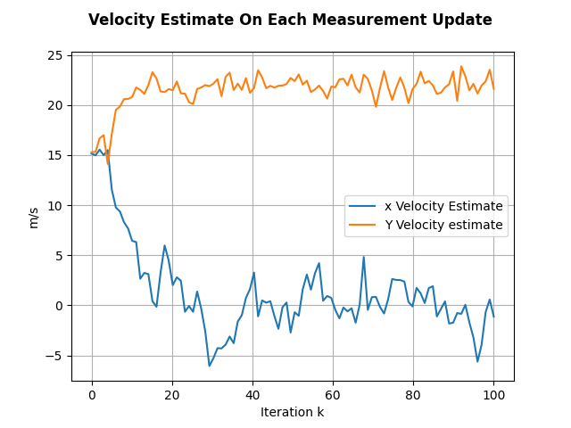

# Kalman Filter Applied to Radar Signal

## Executing program
Eigen library is used for Matrix operations, it is a code dependency. Eigen is a header only library, thus needs only its source files to be copied. Eigen it has been added to this repo as a git submodule. The program can be run as follows:

    cd ..\exercises
    git clone --recurse-submodules https://github.com/sarranetor/eigen.git
    git submodule update --init --recursive
    cd ..\exercises\ekalman_radar
    g++ .\main.cpp -o <name>
    .\<name>.exe

## README Sections
1. Introducrion - (1.1 radar system)
2. Model Description - (2.1 process model 2.2 observation model 2.3 kalman filtering)
3. Results
4. Conclusions
5. References

# 1 Introduction

Compute position (x,y) and velocity (x_vel, y_vel) of an object in motion thanks to a radar with Kalman filter. 

## 1.1 Radar System

Radar System:

Radar measurement output each T time:
- Radius r (meter): distance in meter between the radar and the object. Computed thanks the time to arrival.
- Azimuth az (degree): angle between the object and the radar internal x axes.
- Velocity v (m/s): velocity of the object in the radial direction computed thanks to doopler effect.  
- T sampling time = 1 second

The signals coming from the radar are assumed to have a certain error compared to the true radius, azimuth and velocity. 

This error is assumed to be gaussian with zero mean and varience: **var_r**,  **var_az**,  **var_vel**.

# 2 Model Description

To implement the Kalman filter is necessary to work out the process model and the observations model. In [2] a more in depth description on Kalman theory and proofs are provided.

## 2.1 Process Model
A constant velocity model is assumed. Thus:

$x = x_0 + v*dt$

State Variables: $x_k = [y_k, x_k, y'_k, x'_k]$
where yk and xk is the position in cartesian coordinates and y'k and x'k is the velocity in cartesian coordinates.

State transition equation:

$x[k+1] = A  x[k] + w_k$

Thus the state transition matrix A is

    A = [1, 0, dt, 0,
         0, 1, 0, dt,
         0, 0, 1, 0,
         0, 0, 0, 1]

Where $w_k$ is the process noise. it is assumed gaussian.

## 2.2 Observation Model

$z_k = [radius, azimuth, velocity]$

$z_k = h(x_k) + v_k$ where $z_k$ is the measure at time k, $x_k$ is the state at time k, $v_k$ is the measurement error, it is assumed gaussian.

$radius = h_r(x_k) = \sqrt(x^2 + y^2)$

$azimuth = h_a(x_k) = arctan(y/x)$

$velocity = h_v(x_k) = \sqrt(x.vel^2 + y.vel^2)$

The relation is non linear thus the **Exstended** kalman filter needs to be used. This means to linearise the relationship using the taylor series with the first derivative. H will be the **Jacobian** matrix of $h(.)$ given the state variable.

    H = [y/sqrt(y*y + x*x), x/sqrt(y*y + x*x), 0, 0,
         x/(y*y + x*x),   - y/(y*y + x*x),     0, 0,
         0,     0,     y_vel/sqrt(y_vel^2+ x_vel^2), x_vel/sqrt(y_vel^2+ x_vel^2)]

## 2.3 Kalman filtering

Algorithm:

- Prediction Step:
  
    1. Given $x^- [k-1]$ state estimation and given $P^- [k-1]$ error covariance matrix estimation at time k-1
    2. Project state ahead $x[k] = A  x[k-1]$
    3. Project error covariance ahead $P[k] = A  P^-[k-1] A^T + Q$
  

-  Update Step: 
  
   1. Update $H_k$ Jacobian martix according to projected state
   2. Update kalman gains $K_k = P_k H^T_k (H_k P_k H^T_k + R)^-$ $^1$
   3. Update state estimate with $z_k$ measurement at time k: $x^-[k]  = x_k + K_k(z_k - h(x_k))$   
   4. Update error covariance matrix $P^-[k]=(I - K_k H_k) P_k$

Where **R** is the measurement noise covariance matrix, usually measured prior the operation of the filter and dependent on the measurement system error. In this case the measurement error of our radar system, thus R is set to:

     R = [var_r, 0, 0,
          0, var_az, 0,
          0, 0, var_vel] 

Where **Q** is the process error covariance matrix. It provides and indication on how the prediction process model can be wrong between step k and k+1. In this example Q is set to:

     Q = [20, 0, 0, 0,  
          0, 20, 0, 0,
          0, 0, 4, 0,  
          0, 0, 0, 4] 

note: hp of 4.5 m in std in positions and hp of 2 in std in velocities.

# 3 Results 

The designed filter will be tested with different simulated measures and the filtered signal will be compared with the non-filtered one.

In all tests the measurement error of our radar system is the following:

    var_r=std_r^2  where std_r=30 [m]
    var_az= std_az^2  where std_az=0.009*180/PI [degree]
    var_vel=std_vel^2  where std_vel=1 [m/s]

1. only vel_x=22 m/s - init_position=(x0=3000, y0=3000) - n_iteration=100

xy position                   | xy velocity 
:-------------------------:|:-------------------------:
  |  

- Position Root Mean Square Error Kalman Filtered signal (x_err,y_err)=(6.74, 18.67) 
- Position Root Mean Square Error non filtered signal (x_err,y_err)=(35.63, 34.57)

2. only vel_y=22 m/s - init_position=(x0=3000, y0=3000) - n_iteration=100

xy position                   | xy velocity 
:-------------------------:|:-------------------------:
  |  

- Position Root Mean Square Error Kalman Filtered signal (x_err,y_err)=(19.70, 3.99) 
- Position Root Mean Square Error non filtered signal (x_err,y_err)=(43.44, 35.81)

3. both vel vel_x=12 m/s  vel_y= 8 m/s - init_position=(x0=3000, y0=3000) - n_iteration=50

xy position                   | xy velocity 
:-------------------------:|:-------------------------:
  |  

- Root Mean Square Error Kalman Filtered signal (x_err,y_err)=(16.62, 24.24) 
- Root Mean Square Error non filtered signal (x_err,y_err)=(36.53, 42.73)

4. only vel_y=5 m/s with random gaussian acceleration on x with 5m/s of standard deviation - init_position=(x0=3000, y0=3000) - n_iteration=100 

xy position                   | xy velocity 
:-------------------------:|:-------------------------:
  |  

- Root Mean Square Error Kalman Filtered signal (x_err,y_err)=(26.74, 17.84) 
- Root Mean Square Error non filtered signal (x_err,y_err)=(33.46, 35.95)

# 4 Conclusions

An exstended kalman filter prototype for filtering data from a radar application has been designed and tested. Prototype performance have been tested with simulated signals of objects moving in different situations. The prototype has been codeed in cpp using the Eigen library and tested.

The filter has shown improvements over the measured data in all reported tests. Although more simulations and more scenarions need to be tested to properly assess the filter performance.

The observation model law is non linear, which made necessary the usage of the exstended kalman filter. Future possible work could be implementing an uscended kalman kilter to tackle the non linearity and compare performance with the exstended kalman implementation. Also a constant acceleration process model could be implemented instead of a constant velocity one and results could be compared.

# 5 References

[1]: G. Welch; G. Bishop; "An Introduction to the Kalman Filter"; https://www.cs.unc.edu/~welch/media/pdf/kalman_intro.pdf
[2]: T. Lacey; "Tutorial: The Kalman Filter"; https://web.mit.edu/kirtley/kirtley/binlustuff/literature/control/Kalman%20filter.pdf
[3]: https://github.com/rlabbe/Kalman-and-Bayesian-Filters-in-Python
[4]: W. Franklin; "Kalman Filter Made Easy"; https://thekalmanfilter.com/