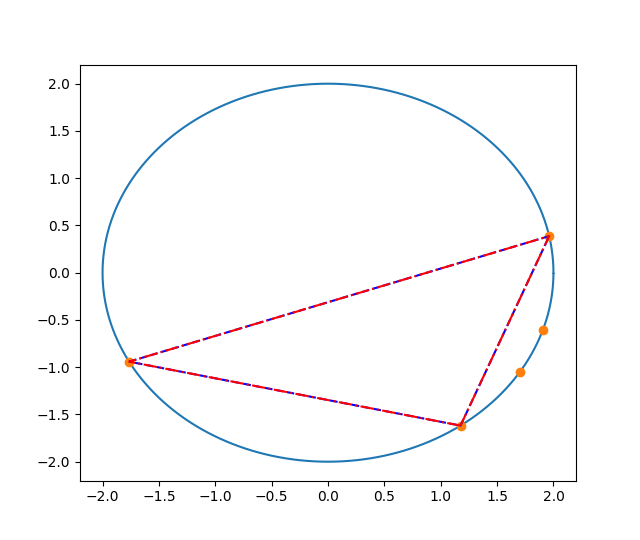

# Greatest Triangle Perimeter in circumference 

## Executing program
No dependencies except the standard library.

      cd ..\exercises\triangle_gperimeter
      g++ .\main.cpp -o <name>
      .\<name>.exe

## Problem 

Given n random points sampled from a circumference find the group that construct the triangle with the greatest perimeter.

## Solutions 

Two methods are proposed and both are coded and has been proven empirically that yeld to the same result. 

**Method 1**:

   1. Using The Equilater Triangle inscribed in the circumference. A equilater triangle inscribed in a circumference is proven to be the triangle with the greatest perimeter possible.
   
- given a set P of N random points sampled.
- given a point p0 belonging to P, it is possible to find the points p1 and p2 that form with p0 an equilater triangle with greatest perimeter.
- p1' and p2' are the points belonging to the set P that are the nearest respectively to point p1 and p2.
- triangle [p0, p1',p2'] is the greatest triangle that can be formed in set P that has p0 in it.

Thus is possible to iterate throughout all points belonging to P and fing the ones that create the triangle with greatest perimeter with O(n) complexity.

**Method 2**:

2. Finding all combinations and check the one with greatest perimeter.

- given a set P of N random points sampled.
- find "N chose 3" combinations.
- search for the combination with greatest perimeter.

The complexity of checking all combinations is O(n choose k), with k=3, this ends up being equivalent to O(min(n^3, n^(n-3))).

## Results and Conclusions
It has been concluded by the author that method1 and method2 lead to the same result, and thus validating empirically method1. With method 1 having far lower complexity over method 2.

Fig1: in the figure there is an example of resulting triangles with 5 randon sampled points from a circumference. The triangle in blue is computed through method 1 and triangle in red through method 2. *Note: triangles lines are overlapping.* 

